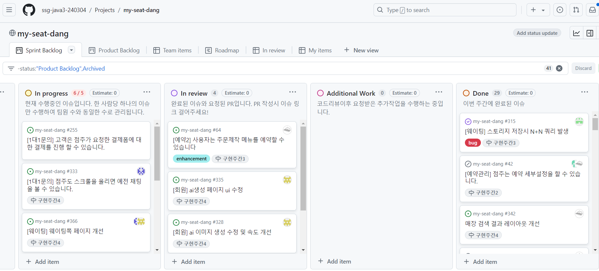
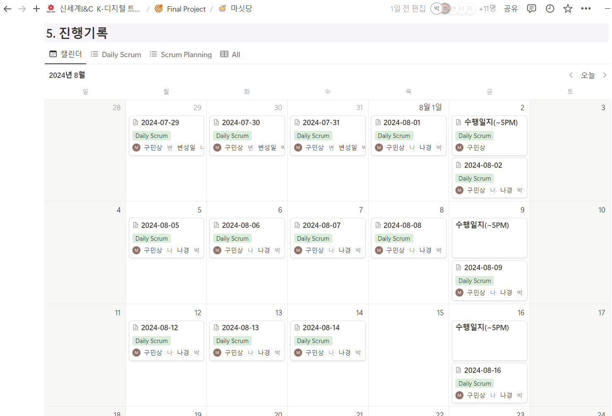
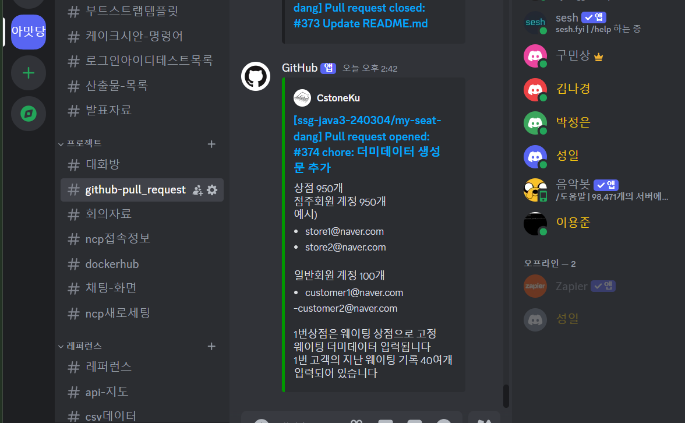

[//]: # (
)

### 🍰 팀명 : MySeatDang(마싯당)

[//]: # (|&nbsp;&nbsp;&nbsp;&nbsp;&nbsp;&nbsp;&nbsp;&nbsp;&nbsp;&nbsp;&nbsp;&nbsp;&nbsp;&nbsp;&nbsp;&nbsp;&nbsp;&nbsp; 구민상)

[//]: # (&nbsp;&nbsp;&nbsp;&nbsp;&nbsp;&nbsp;&nbsp;&nbsp;&nbsp;&nbsp;&nbsp;&nbsp;&nbsp;&nbsp;&nbsp;&nbsp;&nbsp;&nbsp; |)

[//]: # (&nbsp;&nbsp;&nbsp;&nbsp;&nbsp;&nbsp;&nbsp;&nbsp;&nbsp;&nbsp;&nbsp;&nbsp;&nbsp;&nbsp;&nbsp;&nbsp;&nbsp;&nbsp; 변성일)

[//]: # (&nbsp;&nbsp;&nbsp;&nbsp;&nbsp;&nbsp;&nbsp;&nbsp;&nbsp;&nbsp;&nbsp;&nbsp;&nbsp;&nbsp;&nbsp;&nbsp;&nbsp;&nbsp; |)

[//]: # (&nbsp;&nbsp;&nbsp;&nbsp;&nbsp;&nbsp;&nbsp;&nbsp;&nbsp;&nbsp;&nbsp;&nbsp;&nbsp;&nbsp;&nbsp;&nbsp;&nbsp;&nbsp; 박정은)

[//]: # (&nbsp;&nbsp;&nbsp;&nbsp;&nbsp;&nbsp;&nbsp;&nbsp;&nbsp;&nbsp;&nbsp;&nbsp;&nbsp;&nbsp;&nbsp;&nbsp;&nbsp;&nbsp; |)

[//]: # (&nbsp;&nbsp;&nbsp;&nbsp;&nbsp;&nbsp;&nbsp;&nbsp;&nbsp;&nbsp;&nbsp;&nbsp;&nbsp;&nbsp;&nbsp;&nbsp;&nbsp;&nbsp; 이용준)

[//]: # (&nbsp;&nbsp;&nbsp;&nbsp;&nbsp;&nbsp;&nbsp;&nbsp;&nbsp;&nbsp;&nbsp;&nbsp;&nbsp;&nbsp;&nbsp;&nbsp;&nbsp;&nbsp; |)

[//]: # (&nbsp;&nbsp;&nbsp;&nbsp;&nbsp;&nbsp;&nbsp;&nbsp;&nbsp;&nbsp;&nbsp;&nbsp;&nbsp;&nbsp;&nbsp;&nbsp;&nbsp;&nbsp; 김나경)

[//]: # (&nbsp;&nbsp;&nbsp;&nbsp;&nbsp;&nbsp;&nbsp;&nbsp;&nbsp;&nbsp;&nbsp;&nbsp;&nbsp;&nbsp;&nbsp;&nbsp;&nbsp;&nbsp;)

[//]: # (|:---:|:---:|:---:|:---:|:---:|  )

[//]: # (| - 프로젝트 총괄   - Front/Back-end    - [GitHub]&#40;https://github.com/CstoneKu&#41; | - Front/Back-end   - [GitHub]&#40;https://github.com/i-Veni-Vidi-Vici&#41; | - Front/Back-end   - [GitHub]&#40;https://github.com/jeongeun1&#41; | - Front/Back-end   - [GitHub]&#40;https://github.com/yongjun98&#41; | - 기획자   - Front/Back-end   - [GitHub]&#40;https://github.com/nnieun&#41;)

[//]: # (
)

## 💁‍♂️ Role 
** 각 팀원명 클릭시 GitHub 페이지 이동

+ [구민상](https://github.com/CstoneKu)
    - 프로젝트 총괄
    - Front/Back-end
    - 매장(검색, 네이버 지도핀, 매장목록, 필터, 정렬)
    - 메뉴 등록, 수정
    - 예약

+ [변성일](https://github.com/i-Veni-Vidi-Vici)
    - Front/Back-end
    - 카카오톡 결제, 환불
    - 웨이팅
    - redis 문서화

+ [박정은](https://github.com/jeongeun1)
    - Front/Back-end
    - 매장 상세페이지
    - 매장 등록, 수정

+ [이용준](https://github.com/yongjun98)
    - Front/Back-end
    - 초기 CI/CD 구축
    - 채팅(mongo DB)
    - 채팅 내 이미지 생성 및 결제요청
    - mongo DB 관련 문서화

+ [김나경](https://github.com/nnieun)
    - 프로젝트 주제 기획
    - Front/Back-end
    - 로그인 및 인증
    - 회원가입
    - 회원관리
    - 생성형 AI 적용
    - security 관련 문서화

+ 공통
    - 시장 및 유사 프로그램 분석
    - 요구사항 명세서 작성
    - 이벤트 스토밍
    - 엔티티 클래스 다이어그램
    - PPT

 

### Languages

 

### Technologies

[//]: # ()
[//]: # ()
[//]: # ()
[//]: # ()
[//]: # ()
[//]: # ()
[//]: # ()

 
 

---

# 📝 [목차](#index) 

- [개요](#outline)
- [Pain Point](#pain_point)
- [Idea / Solution](#idea)
- [아키텍처](#structure)
- [결과물](#outputs)
- [협업 방식](#work)
- [팀의 개발 문화](#culture)
- [왜 이 기술을 사용했는가?](#why)
- [성과 및 회고](#retrospection)
- [시연영상](#video)

[//]: # (- [리팩토링 & 성능 개선]&#40;#refactoring&#41;)

# 📝 개요 

   
 본문 확인 (👈 Click)

 
'마싯당'은 베이커리 매니아층과 특별한 디저트를 원하는 고객들을 위한 제과점 예약 중개 플랫폼입니다.
최근 소셜 미디어에서 디저트 관련 언급량이 꾸준히 증가하고 있으며, 많은 사람들이 자발적으로 특별한 날을 기념하기 위해 디저트를 선택하고 있습니다. 
이러한 디저트 소비의 수요로 인해 '마싯당' 서비스의 비즈니스적 가치가 충분히 보장된다고 판단했고, 
아래 Pain Point를 해결함으로써 더 나은 서비스를 제공하려 합니다.

# 🧐 Pain Point 

   
 본문 확인 (👈 Click)

 

### 기존의 통합 서비스 부족 및 불편함

+ 현 시장 베이커리/디저트 통합 서비스 현황
  - 현재 베이커리/디저트 관련 매장을 모아놓은 통합 서비스를 찾기 힘듦
  - SNS 인기 매장의 경우, 빠른 품절로인해 소비자의 접근성이 떨어짐

+ 커스텀 케이크 주문 시 불편함
  - 주문자가 원하는 디자인으로 제작 가능한 커스텀 케이크의 경우, 온라인 주문시 채팅이 필수 → 여러 매장에 개별 연락 후 채팅플랫폼으로 별도 이동해야 하는 것이 번거로움
  - 원하는 디자인을 위해 매장-고객 간 소통 시 다소 시간과 노력이 소요될 수 있음

# 💡 Idea / Solution 

   
 본문 확인 (👈 Click)

 

+ 베이커리/디저트 통합 서비스 제공
  - 소비자의 수요를 반영하여 베이커리/디저트 매장을 모아놓은 통합 서비스를 제공
  - 지역별 매장 검색 및 지도를 통해 편리하게 이용 가능

+ 예약 시 채팅 및 AI시안생성 서비스 제공
  - 커스텀 케이크 예약 시 채팅창으로 이동하여 간편하게 문의 및 디테일한 주문요청 가능
  - 서비스 내 생성형 AI를 통해 케이크 시안을 만들고, 생성된 시안으로 빠른 예약 가능

+ 웨이팅 서비스 제공
  - 인기 매장이라도 직접 줄서지 않고, 집 등 외부 장소에서 웨이팅 후 매장 이용 가능

# 📈 아키텍처  

   
 본문 확인 (👈 Click)

 

 

- VPC로 논리적으로 격리된 공간을 만들고 외부 접근 제한
  + VPC가 외부와 통신이 가능하도록 Internet Gateway 를 구성하고 라우팅 테이블에서 Public Subnet(10.0.1.0/24, 10.0.2.0/24)과 연결
  + NAT Gateway를 구성하여 나머지 Private Subnet 리소스가 인터넷으로 트래픽이 통할 수 있도록 연결
  + Bastion EC2를 통해 Private Subnet EC2로 접근
- Jenkins와 CodeDeploy를 사용한 Blue Green 무중단 배포
- Load Balancer과 Auto Scaling으로 트래픽 분산
- Redis Cluster 및 Redis stat 모니터링 구축
- Log Monitor 용 ELK 구축
- 검색용 ELK Cluster 구축
- RDS(MySQL) 이중화 구성

보안을 위해 VPC 안에서 전체적인 AWS 환경을 구축하였고, 내부 접근에는 bastion EC2를 통해 접근하도록 설계했습니다.  
로드밸런서와 오토스캐일링으로 트래픽을 분산했으며, Jenkins와 CodeDeploy를 통해 blue green 무중단 배포 환경을 구축했습니다.  
검색 엔진의 경우 RDS의 데이터를 배치작업을 통해 Elastic Search로 로드하고 ELK 클러스터를 통해 안정적으로 구축했습니다.  
Redis 또한 클러스터로 구축하여 Master가 죽어도 FailOver되어 정상 작동하도록 구축했습니다.  
RDS의 경우 DB 이중화를 통해 부하를 줄여주었습니다.  
모니터링의 경우 Kibana와 Redis-stat를 사용했습니다.

# 🎁 결과물  

   
 본문 확인 (👈 Click)

 

## 앱
### 메인페이지

 

+ 광고배너
+ 검색 버튼
+ 함께 할 친구 찾기 버튼
+ 8가지 카테고리 분류
+ 추천 클래스(회원 가입시 선택한 카테고리 기반)
+ 인기 클래스(조회수 기반)
+ 신규 클래스
+ 하단 네비게이션바 - 홈, 카테고리, 그룹, 찜, 마이

 

### 하단 네비게이션바

 

+ 카테고리 : 다양한 카테고리분류와 지역별을 통해 필터링하여 클래스 검색 기능
+ 그룹 : 자신이 속한 그룹 목록
+ 찜
  + 내가 찜한 클래스
  + 내가 찜한 게시글
  + 내가 속한 그룹원들이 찜한 클래스
+ 마이 : 사용자 정보
  + 카카오 연동 로그인
  + 보유 리워드
  + 보유 쿠폰
  + 나의 게시글
  + 나의 클래스(결제, 결제 대기)
  + 나의 문의
  + 나의 리뷰

 

### 그룹 생성

 

+ 클래스에 수강신청하기 전에 같이 수강할 사람을 모으기 위해 그룹을 생성

 

### 그룹 상세 페이지

 

+ 그룹에 대한 요약 정보
+ 그룹원들이 찜한 클래스 공유
+ 그룹의 공통 태그 기반 클래스 추천
+ 그룹 리더의 경우, 사용자 초대 기능
+ 그룹원 목록 -> 클릭시 그룹원 프로필 확인 가능
+ 그룹원간의 채팅 기능 -> 채팅 대상 클릭시 프로필 확인 가능

 

### 게시글 생성

 

+ 그룹을 생성했다면, 그룹원들을 모으기 위해 만드는 게시글
+ 마이페이지 나의 게시글에서 확인이 가능하며, 게시글 우측 하단의 버튼으로 활성화, 비활성화 가능

 

### 그룹원 모집 게시글 페이지 및 게시글 상세 페이지

 

+ 그룹원 모집 게시글 페이지
  - 특정 클래스를 함께 수강신청할 사람들을 모집하는 곳
  - 게시글을 통해 모집이 번거롭다면, 상단의 있는 함께할 친구 매칭버튼을 클릭하여 빠르게 매칭이 가능
+ 게시글 상세 페이지
  - 게시글 모집 요약
  - 선택한 클래스 정보(함께 수강하고 싶은 클래스)
  - 해당 모집 게시글에 참여하고 있는 그룹원 정보
  - 좌측 하단 하트 버튼으로 게시글 찜
  - 참가신청 기능

 

### 매칭 시스템 - 함께 할 친구 매칭하기

 

+ 게시글을 통해 클래스를 함께 수강신청할 사람들을 모집하기 번거로울 경우, 빠르게 그룹을 형성해주는 기능
+ 매칭을 원하는 지역, 클래스 카테고리, 요일, 시간, 인원을 입력하면 이를 기반으로 빠르게 함께할 사람을 매칭하여 그룹 생성
+ 매칭중에는 '함께할 친구 매칭하기' 버튼 문구가 '함께할 친구 매칭중'으로 변경되고 이때 클릭 시 매칭 중단 가능

 

### 클래스 상세 페이지

 

+ 클래스 상세 정보
+ 개인, 그룹 단위로 신청이 가능하며, 인원에 따른 가격 할인폭 변동
+ 하단에 고객에게 비슷한 카테고리 기반 다른 클래스 추천
+ 함께할 사람 찾기 버튼 클릭 시, 해당 클래스를 함께 들을 사람을 모집하는 게시글을 필터링하여 제시
+ 우측 상단에 공유 버튼 클릭시, 카카오톡으로 공유 또는 링크 복사 기능

 

### 클래스 검색 필터

 

+ 다양한 필터링 검색 기능
  + 지역별, 인기순, 금액순 등등

 

### 알림

 

+ 매칭, 이벤트 등을 알려주는 알림 기능

 

### 마이페이지
#### 회원가입 및 로그인

 

 

#### 리워드

 

 

#### 쿠폰

 

 

#### 프로필 편집, 나의 게시글, 나의 클래스, 나의문의, 나의 리뷰

 

 

### 결제

 

 

## 디렉터 전용 웹
### 로그인 페이지

 

 

### 메인 페이지

 

 

### 디렉터 소개 수정

 

 

### 공지사항 조회

 

 

### 클래스 등록

#### 1. 기본 정보 입력

 

+ 클래스 개설의 첫번째 단계로 기본적인 정보를 입력하는 페이지

 

#### 2. 상세 소개

 

+ 클래스 개설의 두번째 단계로 클래스의 상세 소개를 입력하는 페이지

 

#### 3. 커리큘럼

 

+ 클래스 개설의 세번째 단계로 커리큘럼을 입력하는 페이지

 

#### 4. 스케줄

 

+ 클래스 개설의 네번째 단계로 클래스의 스케줄 정보를 입력하는 페이지

 

#### 5. 가격 및 쿠폰

 

+ 클래스 개설의 다섯번째 단계로 클래스의 가격 정보 및 할인 쿠폰 정보를 입력하는 페이지

 

#### 6. 부가 정보

 

+ 클래스 개설의 마지막 단계로 약관 동의를 입력받는 페이지

 

### 내 클래스 목록

 

+ 내가 개설한 클래스의 상태를 볼 수 있는 페이지
  + 상태 : 진행중, 작성중, 검수중, 검수 거절, 종료
  + 검수가 완료된 클래스의 경우, 스케줄 정보만 변경 가능

 

### 클래스 관리

 

+ 내가 개설한 클래스의 스케줄별 상태 및 정보를 조회할 수 있는 페이지

 

### 문의 관리

 

+ 내가 개설한 클래스에 고객이 남긴 문의글을 확인하고 답글을 달 수 있는 페이지

 

### 리뷰 관리

 

+ 내가 개설한 클래스에 고객이 남긴 리뷰를 확인하는 페이지

 

### 채팅

 

+ 내가 개설한 클래스에 수강신청한 고객과 채팅하는 페이지

 

### 할인 쿠폰 관리

 

+ 내가 개설한 클래스에서 제공하고 있는 할인 쿠폰을 관리하는 페이지

 

## 백오피스 어드민 전용 웹
### 로그인 페이지

 

 

### 알림 보내기

 

+ 전체 유저에게 또는 특정 유저를 검색하여 해당 유저에게 알림을 보낼 수 있는 페이지

 

### 클래스 검수하기

 

+ 디렉터가 등록한 클래스에 대해 검수를 진행하는 페이지
  + 적절한 경우, 승인
  + 적절하지 않은 경우, 거부

 

### 공지사항

 

+ 공지사항을 생성, 수정, 삭제 할 수 있는 페이지

# ⏰ 협업 방식 

   
 본문 확인 (👈 Click)

 

#### 저희 팀은 협업 방식으로 GitHub, Notion, Discord를 사용했습니다.
1. 먼저 요구사항명세서를 작성한 후 이를 기반으로 GitHub에 이슈를 생성하고, 칸반보드를 통해 모든 task들을 이번주에 개발해야할 기능, 개발 진행중, 개발 완료된 칸으로 옮기면서 한눈에 볼 수 있도록 진행했습니다.  
2. Notion에서 데일리 스크럼을 작성하며 어제 한 일, 오늘 할 일, 겪은 어려움을 공유하고 매일 진행상황을 체크했습니다.
3. 또한 수시로 발생하는 건에 대하여 주제별로 소통하기 쉽게 Discord에 채널을 생성하여 관리했습니다.

# 🎈 팀의 개발 문화 

   
 본문 확인 (👈 Click)

 

#### 각자의 역량을 인지하고, 서로 돕기
팀 프로젝트는 개인의 역량만으로는 완성될 수 없습니다.
저희는 각자의 강점을 이해하고 이를 바탕으로 협력하여 프로젝트를 성공적으로 이끌어왔습니다.
전체 프로젝트에서 코드구현, 서류작업 등 모든 작업 대상으로 팀원 각각이 더 잘 할 수 있는 분야에서 최선을 다하며,
구현 중 막히는 부분이 있을때는 대면 또는 디스코드 회의실에서 의견을 나누고 문제를 함께 해결해 나갔습니다.
이러한 협력의 과정은 단순히 문제를 해결하는 데 그치지 않고, 팀워크를 강화하고 서로의 신뢰를 쌓는 중요한 기회가 되었습니다. 
팀원 간의 상호 지원과 소통이 있었기에, 하나의 목표를 향해 힘을 합쳐 나아갈 수 있었습니다.

# 💎 왜 이 기술을 사용했는가? 

   
 본문 확인 (👈 Click)

 

## API 문서화

 

Jira로 일정관리를 하고 있었기에 프로젝트 초기에는 Jira Confluence를 사용하여 API 문서화를 진행했습니다.  
프로젝트 초기 단계가 지나 작성해야 하는 API들이 많아지면서 일일이 Confluence에 작성하고 확인하기가 번거로워졌기에 코드상으로 해결 가능한 Swagger를 적용하여 문서화를 진행했습니다.  
이후 프로젝트의 중후반 단계가 되었을 때, 정말 많은 API들을 만들게 되었는데 이 과정에서 Swagger의 단점이 명확하게 보이기 시작했습니다.
1. 문서화 작업을 위한 Swagger 애노테이션으로 인해 코드의 가독성이 떨어진다.
2. 테스트 기반이 아니기에 기능이 100% 동작한다고 확신할 수 없다.
3. 모든 오류에 대한 여러 가지 응답을 문서화할 수 없다.

위와 같은 문제를 Spring REST docs는 모두 해결할 수 있었기에 Spring REST docs로 전환하게 되었습니다.

 

## Querydsl
Spring Data JPA가 기본적으로 제공해주는 CRUD 메서드 및 쿼리 메서드 기능을 사용하더라도, 원하는 조건의 데이터를 수집하기 위해서는 필연적으로 JPQL을 작성하게 됩니다.  
간단한 로직을 작성하는데 큰 문제는 없으나, 복잡한 로직의 경우 개행이 포함된 쿼리 문자열이 상당히 길어집니다.  
JPQL 문자열에 오타 혹은 문법적인 오류가 존재하는 경우, 정적 쿼리라면 어플리케이션 로딩 시점에 이를 발견할 수 있으나 그 외는 런타임 시점에서 에러가 발생합니다.  
이러한 문제를 해결해 주는 것이 Querydsl이기에 Querydsl을 도입했습니다.  
Querydsl 도입으로 다음과 같은 이점을 얻었습니다.
+ 문자가 아닌 코드로 쿼리를 작성함으로써, 컴파일 시점에 문법 오류를 쉽게 확인할 수 있다.
+ 자동 완성 등 IDE의 도움을 받을 수 있다.
+ 동적인 쿼리 작성이 편리하다.
+ 쿼리 작성 시 제약 조건 등을 메서드 추출을 통해 재사용할 수 있다.

 

## 토근 저장소 MySQL -> Redis
로그인 관련해서는 JWT토큰을 이용해 구현했습니다.  
이 과정에서 Access Token과 Refresh Token의 유효시간이 지나게 되면 expire 되도록 처리를 해야했는데 이 과정을 MySQL에서 진행하기에는 부담이 되는 작업이었습니다.  
하지만 해당 작업을 Redis의 TTL기능을 사용하여 구현한다면 간단하게 처리할 수 있었기에 토큰 저장소로 Redis를 사용하게 되었습니다.  
Redis를 처음 사용해보는 것이기에 초기에는 하나의 EC2에 Redis를 띄워 사용하였으나, 멘토님의 조언을 듣고 조금 더 안전한 설계로 변경하게 되었습니다.

 

설계 초기처럼 하나의 Redis만 사용할 경우, Redis가 죽어버리면 Redis를 사용하는 로직에 생기기 때문에 Master Redis 3대, Slave Redis 6대를 띄워 클러스터를 구축하였습니다.  
따라서 하나의 Master Redis가 죽어도 Failover을 통해 Slave가 Master로 승격되기 때문에 가용성을 높일 수 있었습니다.

 

## RabbitMQ -> Redis Expire Event + Spring batch

 

결제 과정에서 그룹 수강신청의 경우, 그룹이 신청한 스케줄에 대해서는 그룹 인원만큼의 여석은 다른 고객이 신청하지 못하도록 막아서 확보해야 했습니다.  
예를 들면, 0/8 인 상태에서 4명이 있는 그룹이 수강신청을 한다면 4/8 인 상태로 변경해야 했습니다. 이 과정에서 그룹원들이 결제할 때까지 시간을 무한정으로 줄 수 없기 때문에 30분으로 제한하도록 비즈니스 로직을 설계했습니다.  
따라서 30분이 지난 후에 결제가 완료되지 않았다면 해당 그룹의 수강 신청을 취소시켜야했습니다.  
처음에는 이 로직을 구현하기 위해서 RabbitMQ를 사용하여 다음과 같이 구현했습니다.

> 수강 신청시 RabbitMQ로 메시지를 보내고, RabbitMQ Delayed Message Plugin를 이용해 30분이 지난 후에 처리한다.

RabbitMQ를 처음 사용해 보는 기술이었기에 멘토님께 조언을 구했고 RabbitMQ도 결국 거대한 큐이기 때문에 30분 동안 저장해두고 처리하도록 설계할 경우, 수많은 요청이 몰리면 병목현상이 발생할 것이라는 조언을 받아 다른 방식을 도입해야 했습니다.  
프로젝트에서 캐시와 토큰 저장소로 Redis를 사용하고 있기에 'Redis의 TTL을 활용하면 이 문제를 해결할 수 있지 않을까?'라는 생각으로 설계를 다시 하기 시작했습니다.  
수강 신청 시 TTL을 30분으로 설정하여 redis에 저장해두고 TTL이 끝나면 pub/sub 방식으로 message를 쏘도록 만들어 준 뒤, Spring에서는 메시지 리스너를 구현해 메시지를 받아 로직을 수행하도록 구현했습니다.  
하지만 이 메시지가 100% 리스너에 도착한다고 보장할 수는 없기 때문에 이에 대한 안전 장치로 Spring batch + Quartz 를 사용하여 30분마다 배치 작업을 수행하도록 설계했습니다.

 

결과적으로 문제를 해결했지만 설계상으로 아직 해결하지 못한 부분이 남아있습니다.  
redis key expire이 pub/sub 방식으로 message를 전달하기 때문에 여러 서버에서 구독을 하게 된다면 중복해서 처리하게 되는 문제가 발생합니다. 따라서 프로젝트 구성에서는 하나의 서버가 이 로직을 담당했고 스케일 아웃은 못하고 스케일 업을 해야만 했습니다.  
이 문제는 그당시에는 해결하지 못했고 현재 kafka를 공부하면서 컨슈머 그룹을 사용하면 이 문제를 해결할 수 있을 것 같다는 생각이 듭니다.

 

## DB Replication

 

초기에는 하나의 RDS를 가지고 모든 작업을 진행했습니다.  
하지만 트래픽이 늘어날 경우, 하나의 DB에서 쿼리를 모두 처리하기에는 병목현상이 발생할 가능성이 있다고 판단했습니다.  
따라서 DB 이중화를 도입했습니다.  
DB를 이중화할 경우, Master에서는 쓰기/수정/삭제 연산을 처리하고 Slave에서는 읽기 연산만을 처리하여 병목 현상을 줄일 수 있었습니다.

 

## 검색 기능 DB -> Elasticsearch

 

기존에는 클래스 검색에 AWS RDS에서 데이터를 꺼내오도록 했으나 검색 성능 향상을 위해 Elastic Search로 전환했습니다.

 

## Flyway

 

dev 환경에서는 단순히 ddl을 create-drop 또는 update 옵션을 사용하고 있었기에 DB에 대해 고민할 필요가 없었습니다.  
하지만 운영환경에서는 ddl을 validate 또는 none 옵션을 사용해야하기 때문에 초기에는 DB script를 뽑아서 별도로 관리를 했습니다.  
이후 기능이 추가되면서 script가 변경되는 일이 빈번해졌고, 매번 일일이 스크립트를 관리하는 것이 번거로울 뿐 아니라 실수하기 딱 좋은 부분이라 Flyway를 도입하여 데이터베이스 형상관리를 진행했습니다.

 

## Cloud Watch -> Kibana

 

초기 구축에서는 간단하게 Cloud Watch를 사용하고 로그 모니터링 환경을 구축했습니다.  
Cloud Watch만으로도 충분히 원하는 목적을 달성할 수 있었지만, 취업을 준비하는 입장에서 AWS 자원을 마음껏 사용할 수 있는 기회는 드물기 때문에 여러 가지를 도전해 보고 싶었습니다.  
마침 검색 엔진을 Elastic Search로 변경해서 성능을 높여보자는 의견이 팀에서 있었기에 여러 가지 도전을 해보고자 모니터링도 Kibana로 변경해서 구축하게 되었습니다.    
각 EC2에 filebeat를 심어주고 logstash에서 가공하여 elastic search로 보내도록 설계해서 구축하였습니다.

 

## Jenkins

 

CI/CD 구축을 처음 진행해보기에 처음에는 가장 간단한 Travis CI로 구축을 연습하고 실제 프로젝트에 적용을 시도했습니다.  
하지만 SW Maestro에서 제공하는 Gitlab 계정으로 Gitlab, Travis CI 연동이 불가능했습니다.(프로젝트 진행 후반부에야 연동이 가능하도록 업데이트 되었습니다.)  
따라서 다른 선택지가 없어 Jenkins와 AWS CodeDeploy를 이용해 Blue Green 무중단 배포를 구축했습니다.  
프로젝트의 규모를 생각했을 때, 다양한 세팅과 서버를 구축해야하는 Jenkins가 최선의 선택은 아니라고 생각합니다.  
하지만, 경험적 측면에서는 서버를 구축하고 Jenkins의 다양한 플러그인을 사용해볼 수 있었다는 점에서 경험적으로 좋은 선택이었던 것 같습니다.

 

## 전체적인 AWS 구축 환경 구조 선택

초기에는 간단하게 Jenkins에서 EC2로 jar 파일을 넘겨 서버를 실행하도록 구성했습니다. 그러나 프로젝트가 점점 커지면서 문제가 발생했습니다.
1. 배포 과정에서 서비스가 중단된다.
2. 모든 트래픽을 하나의 서버가 받는다.
3. 보안에 문제가 있다.
4. java -jar로 서버를 껐다가 키는 명령어를 계속 입력하기 불편하다.

해결 방식
1, 2번 : 오토스케일링과 로드밸런서를 통해 트래픽을 분산시켰고 blue/green 배포 방식을 통해 무중단 배포를 구성했습니다.  
3번 : VPC를 구성하여 격리된 네트워크 공간을 만들어 다른 사람들이 접근하는 것을 막았고 bastion EC2를 두어 이를 통해 접근하도록 구성했습니다.  
4번 : 도커를 사용해서 서버를 띄워 명령어의 불편한 점을 해결했습니다.

이 과정에서 다시 문제가 발생했는데 EC2를 생성하는 오토스케일링의 기반 AMI에는 서버 파일이 없다는 것입니다.  
따라서 배포 시에 Jenkins에서 스프링 빌드 후 도커 파일을 빌드하여 생성된 이미지 파일을 도커 허브에 올리고 배포되는 서버와 오토스케일링으로 생성되는 EC2는 모두 도커 허브에 올라가 있는 이미지 파일을 받아서 서버를 실행하도록 구성했습니다.

위의 문제 상황들을 해결하여 최종적으로 Docker, Jenkins, Auto Scaling, Load Balancer, S3, CodeDeploy blue/green 를 사용한 AWS 환경을 구축하였습니다.

+ 최종 프로젝트 적용 구조 : [링크](https://github.com/backtony/SW-Maestro-gjgs#structure)
+ 구축 포스팅 : [링크](https://backtony.github.io/spring/aws/2021-08-28-spring-cicd-3/)

 

## 채팅

 

초기에 채팅기능구현에 Socket.IO, Web RTC 등 다양한 시도를 했습니다. 하지만 앱에서의 최적화되어있지 않아 구현에 어려움이 있었습니다.  
그래서 실제 비즈니스에서 많이 활용 중인 Firebase의 데이터베이스를 사용하여 보다 앱 환경에서 최적화된 실시간 데이터 통신 서비스를 구현했습니다.

 

## CORS

 

백엔드 서버 혹은 외부 API에서 데이터 요청 시 CORS 정책으로 인해 통신이 잘 이루어지지 않는 문제가 있었습니다.  
임시적인 방편으로 보편적으로 사용되는 “Access-Control-Allow-Origin” 헤더를 통해 해결을 시도했으나 이 또한 문제가 있어 Proxy서버와 DNS를 통해 해결을 하였습니다.

# 📌 성과 및 회고 

   
 본문 확인 (👈 Click)

 

## 구민상
내용작성  

## 변성일
내용작성 

## 박정은
내용작성

## 이용준
내용작성

## 김나경
내용작성

# 🎬 시연 영상 

   
 본문 확인 (👈 Click)

 

[시연 영상](https://www.youtube.com/watch?v=BDnmRlhpV-M)  
최종 발표 진행 중에 사용한 시연 영상입니다.

