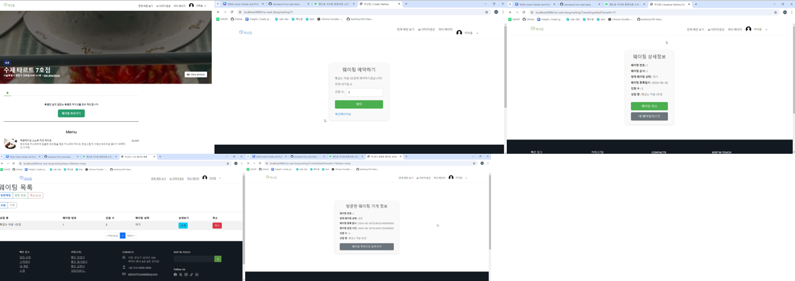

고객 테스트 계정
- customer1@naver.com
- 1번부터 100번까지 계정이 준비되어 있습니다

웨이팅 베이커리 
- 상호 : 마싯당 1호점
- 테스트 계정 : store1@naver.com

예약 베이커리
- 상호 : 마싯당 3호점
- 테스트 계정 : store3@naver.com

주문제작 베이커리
- 상호 : 마싯당 5호점
- 테스트 계정 : store5@naver.com

### 🍰 팀명 : MySeatDang(마싯당)

 

## 💁‍♂️ Role 
** 각 팀원명 클릭시 GitHub 페이지 이동

+ [구민상](https://github.com/CstoneKu)
    - Front/Back-end
    - 매장(검색, 네이버 지도핀, 매장목록, 필터, 정렬)
    - 메뉴 등록, 수정
    - 예약
    - 더미 데이터 생성

+ [변성일](https://github.com/i-Veni-Vidi-Vici)
    - Front/Back-end
    - 카카오톡 결제, 환불
    - 웨이팅
    - redis 문서화

+ [박정은](https://github.com/jeongeun1)
    - Front/Back-end
    - 매장 상세페이지
    - 매장 등록, 수정

+ [이용준](https://github.com/yongjun98)
    - Front/Back-end
    - 초기 CI/CD 구축
    - 채팅(mongo DB)
    - 채팅 내 이미지 생성 및 결제요청
    - mongo DB 관련 문서화

+ [김나경](https://github.com/nnieun)
    - Front/Back-end
    - 프로젝트 주제 기획
    - 로그인 및 인증(security)
    - 회원가입 및 회원관리
    - 생성형 AI 적용
    - NCP 스토리지

+ 공통
    - 시장 및 유사 프로그램 분석
    - 요구사항 명세서 작성
    - 이벤트 스토밍
    - 엔티티 클래스 다이어그램
    - PPT 등

 

### Languages

 

### Technologies

 

### Development Tools

 

### 외부 API
* DALL·E 3
* Daum 주소찾기
* Kakao Pay
* Naver Map

 

---

# 📝 [목차](#index) 

- [개요](#outline)
- [Pain Point](#pain_point)
- [Idea / Solution](#idea)
- [아키텍처](#structure)
- [결과물](#outputs)
- [협업 방식](#work)
- [팀의 개발 문화](#culture)
- [왜 이 기술을 사용했는가?](#why)
- [성과 및 회고](#retrospection)
- [시연영상](#video)
 

# 📝 개요 

   
 본문 확인 (👈 Click)

 
'마싯당'은 베이커리 매니아층과 특별한 디저트를 원하는 고객들을 위한 제과점 예약 중개 플랫폼입니다.
최근 소셜 미디어에서 디저트 관련 언급량이 꾸준히 증가하고 있으며, 많은 사람들이 자발적으로 특별한 날을 기념하기 위해 디저트를 선택하고 있습니다. 
이러한 디저트 소비의 수요로 인해 '마싯당' 서비스의 비즈니스적 가치가 충분히 보장된다고 판단했고, 
아래 Pain Point를 해결함으로써 더 나은 서비스를 제공하려 합니다.

 

# 🧐 Pain Point 

   
 본문 확인 (👈 Click)

 

### 기존의 통합 서비스 부족 및 불편함

+ 현 시장 베이커리/디저트 통합 서비스 현황
  - 현재 베이커리/디저트 관련 매장을 모아놓은 통합 서비스를 찾기 힘듦
  - SNS 인기 매장의 경우, 빠른 품절로인해 소비자의 접근성이 떨어짐

+ 커스텀 케이크 주문 시 불편함
  - 주문자가 원하는 디자인으로 제작 가능한 커스텀 케이크의 경우, 온라인 주문시 채팅이 필수 → 여러 매장에 개별 연락 후 채팅플랫폼으로 별도 이동해야 하는 것이 번거로움
  - 원하는 디자인을 위해 매장-고객 간 소통 시 다소 시간과 노력이 소요될 수 있음

 

# 💡 Idea / Solution 

   
 본문 확인 (👈 Click)

 

+ 베이커리/디저트 통합 서비스 제공
  - 소비자의 수요를 반영하여 베이커리/디저트 매장을 모아놓은 통합 서비스를 제공
  - 지역별 매장 검색 및 지도를 통해 편리하게 이용 가능

+ 예약 시 채팅 및 AI시안생성 서비스 제공
  - 커스텀 케이크 예약 시 채팅창으로 이동하여 간편하게 문의 및 디테일한 주문요청 가능
  - 서비스 내 생성형 AI를 통해 케이크 시안을 만들고, 생성된 시안으로 빠른 예약 가능

+ 웨이팅 서비스 제공
  - 인기 매장이라도 직접 줄서지 않고, 집 등 외부 장소에서 웨이팅 후 매장 이용 가능

 

# 📈 아키텍처  

   
 본문 확인 (👈 Click)

 

 

# 🎁 결과물  

   
 본문 확인 (👈 Click)

 

## [ 앱 ]
### 메인페이지

 

+ 로그인 아이콘
+ 상단 카테고리 배너
+ 카테고리 카드
+ AI 시안생성 광고 배너
+ 네이게이션바 - 전체 매장보기, AI 이미지 생성, 마이페이지

 

### 회원가입 및 로그인

+ 회원가입
+ 로그인 : 일반 로그인, 네이버 로그인

 

### 전체 매장 조회 및 일반 베이커리 예약

+ 매장 검색(매장명, 지역별)
+ 매장 검색 시 지도에 마크 표시
+ 탭 클릭하여 카테고리별 조회 가능(전체/웨이팅/예약방문/주문제작케이크)

+ 일반 베이커리 예약 : 예약일시, 수량 선택

 

### 웨이팅

+ 웨이팅

 

### 주문 제작 케이크 예약 (채팅 포함)

+ 픽업일시, 케이크맛, 사이즈, 레터링 입력 후 예약
+ 예약하기 클릭하면 예약목록으로 이동
+ 예약목록에서 디자인 상담 클릭하여 채팅
+ 하단의 초록색 버튼 클릭하여 AI 시안 생성하기
+ 시안 생성 완료 후 케이크 아이콘 클릭하여 이미지 선택하기

 

### AI 시안 생성하기

+ 채팅 중이 아니어도 별도 페이지에서 AI 시안 생성 가능

 

### 마이페이지

+ 프로필, 회원정보 수정

 

### 점주 페이지

+ 네비게이션바 - 웨이팅 현황, 설정(웨이팅 설정), 매장관리(매장등록, 매장수정), 메뉴관리(메뉴목록, 메뉴등록), 예약관리
+ 웨이팅 설정 : 웨이팅 오픈/마감 시간 설정, 한 팀당 예상 대기 시간 설정, 한 팀당 최대 웨이팅 가능 인원수 설정, 웨이팅 상태설정
+ 매장등록 : 매장명, 카테고리, 매장소개, 공지사항, 매장 전화번호, 매장 이미지, 주소, 영업시간
+ 매장수정 : 매장등록 페이지와 동일
+ 메뉴 목록 : 메뉴 수정, 삭제 가능
+ 메뉴 등록 : 메뉴 이미지, 메뉴명, 가격, 메뉴소개, 판매상태
+ 메뉴 수정 : 메뉴 등록 페이지와 동일

 

### 결제

+ 큐알코드 스캔 후 카카오페이 결제 가능

 

---
## [ 웹 ]
### 메인페이지

 

### 회원가입 및 로그인

 

### 전체 매장 조회 및 일반 베이커리 예약

 

### 웨이팅

 

### 주문 제작 케이크 예약 (채팅 포함)

 

### AI 시안 생성하기

 

### 마이페이지

 

### 점주 페이지

 

### 결제

 

 

# ⏰ 협업 방식 

   
 본문 확인 (👈 Click)

 

#### 저희 팀은 협업 방식으로 GitHub, Notion, Discord를 사용했습니다.
1. 먼저 요구사항명세서를 작성한 후 이를 기반으로 GitHub에 이슈를 생성하고, 칸반보드를 통해 모든 task들을 이번주에 개발해야할 기능, 개발 진행중, 개발 완료된 칸으로 옮기면서 한눈에 볼 수 있도록 진행했습니다.  
2. Notion에서 데일리 스크럼을 작성하며 어제 한 일, 오늘 할 일, 겪은 어려움을 공유하고 매일 진행상황을 체크했습니다.
3. 또한 수시로 발생하는 건에 대하여 주제별로 소통하기 쉽게 Discord에 채널을 생성하여 관리했습니다.

 

# 🎈 팀의 개발 문화 

   
 본문 확인 (👈 Click)

 

#### 각자의 역량을 인지하고, 서로 돕기
팀 프로젝트는 개인의 역량만으로는 완성될 수 없습니다.
저희는 각자의 강점을 이해하고 이를 바탕으로 협력하여 프로젝트를 성공적으로 이끌어왔습니다.
전체 프로젝트에서 코드구현, 서류작업 등 모든 작업 대상으로 팀원 각각이 더 잘 할 수 있는 분야에서 최선을 다하며,
구현 중 막히는 부분이 있을때는 대면 또는 디스코드 회의실에서 의견을 나누고 문제를 함께 해결해 나갔습니다.
이러한 협력의 과정은 단순히 문제를 해결하는 데 그치지 않고, 팀워크를 강화하고 서로의 신뢰를 쌓는 중요한 기회가 되었습니다. 
팀원 간의 상호 지원과 소통이 있었기에, 하나의 목표를 향해 힘을 합쳐 나아갈 수 있었습니다.

 

# 💎 왜 이 기술을 사용했는가? 

   
 본문 확인 (👈 Click)

 

## 웨이팅_Redisson의 pub/sub
1. 초기 설계
+ 웨이팅 데이터를 디스크와 메모리 중 어디에 저장할지 고민하는 과정을 거침
+ 디스크 대비 메모리의 성능적 우위를 쉽게 판단하기 어려운 상황이었음
+ 메모리를 선택했을시, 추가적 학습시간 다소 소요될 것으로 예상
+ 결과 : 웨이팅 데이터를 디스크에 저장

2. 구현 과정
+ 추가 필드 생성 : 웨이팅 번호와 웨이팅 순서를 상점마다 고유한 숫자로 정함
+ 웨이팅 서비스에서 빈번히 발생하는 CRUD 프로세스로 인해 디스크에서 I/O 발생 → 최적화 필요
+ 테이블 분리 : 현재 웨이팅 데이터(CRUD 빈번히 발생) - 이전 웨이팅 데이터(단순 조회)

3. 웨이팅의 동시성 제어 구현 중 발생한 이슈
+ 동시성 고려해야 하는 이유 : 웨이팅 번호 중복, 웨이팅 순서 오류, 웨이팅 서비스 지연
+ 분산락 중 Named Lock 적용하였으나 HikariCP Dead Lock 이슈 발생
+ 부하상태의 전제조건 하에 하나의 task에서 두개 이상의 Connection이 필요할때 Dead Lock 발생
+ Entity의 Id 생성전략을 변경하고 Pool size를 늘려 해결하는 방법도 있으나, 예상치 못하게 재발생 가능성 있음
+ 데이터 소스 분리가 필요하나 현재로선 같은 DB를 사용하기 때문에 Named Lock 사용시 더 많은 부하가 생김

4. 위 이슈 해결방법 : Redisson pub/sub 적용
+ pub/sub : 채널에 락을 점유 중인 스레드가 락을 해제했음을 알리고, 이 사실을 대기중인 스레드에게 전달하면, 대기중인 스레드가 락 점유를 시도하는 방식
+ 디스크에 저장되는 현재 웨이팅 데이터(CRUD 빈번히 발생)를 메모리로 관리하고자 Redis 적용

5. Redis 적용 후
+ 현재 웨이팅 데이터(CRUD 빈번) : Redis에 저장(용량은 다소 적지만 속도가 빠름)
+ 이전 웨이팅 데이터(단순 조회) : MySQL DB에 저장(스프링 스케줄링 작업)

> 결과 : 매일 메모리 크기가 상대적으로 적은 Redis에서 현재 웨이팅 데이터가 삭제되고, 메모리 크기가 큰 MySQL DB에 이전 데이터로 이동됨

 

## 예약_MySQL Named Lock
1. 예약 한도를 초과하는 예약 건수 발생시 문제
+ 예약한도가 2건인 매장에 같은 시간에 3건의 예약이 발생하면 DB 데이터 불일치 발생
 
→ 예약 동시성 제어 필요

2. 시도한 방법
+ 비관적 락(Pessimistic Lock)
  - 개념 : 데이터를 수정하기 전에 락을 걸어 다른 트랜잭션이 해당 데이터를 수정하지 못하도록 하는 방식
  - 특징 : 락이 걸린 데이터에 대해 읽기와 쓰기를 제한
  - 적용 : 예약 한도를 관리하는 예약 슬롯 데이터에 비관적 락 적용, Repository에 @Lock(LockModeType.PESSIMISTIC_WRITE) 어노테이션 적용

  - 실패 : insert 경쟁으로 인한 데드락 발생, DB에 아직 존재하지 않는 데이터에 대해서는 Lock을 걸 수 없음, 미리 삽입된 예약 슬롯 데이터 필요
+ Synchronized
  - 개념 : 자바에서 동기화를 구현하기 위해 사용되는 키워드
  - 특징 : 데이터 일관성 유지, Race Condition 방지
  - 한계 : 단일 스레드만 지원하므로 다중 서버를 사용하면 동시성 제어 불가
+ Named Lock
  - 개념 : 특정 이름을 가진 사용자 정의 잠금을 이용해 동기화된 접근을 보장하는 락 메커니즘
  - 특징 : 독립적인 잠금, 트랜잭션과 독립됨, 자체적인 Time out
  - Named Lock 적용 이유 : 트랜잭션과 독립하여 Key를 얻을 수 있음 → 존재하지 않는 데이터에 접근을 제어할 수 있음
  - Lock Pacade 구현 후 실패 : HikariCP의 커넥션 풀이 요청 수보다 작았음

> 해결 : Connection Pool 설정 변경 

## 채팅_SSE 기반 채팅
1. 사용 기술
+ SSE(Server-Side Event) : 서버가 클라이언트에 실시간으로 이벤트를 푸시하는 기술
+ Spring Web Flux : 비동기 처리와 논블로킹 입출력을 지원
+ Mongo DB : NoSQL 데이터베이스, JSON 형태의 문서 기반 데이터 저장을 지원

2. 위 기술을 사용한 이유
+ SSE(Server-Side Event) : 단방향 실시간 데이터 스트리밍, 자동 재연결 가능, 저렴한 리소스 사용
+ Spring Web Flux : 리액티브 프로그래밍 지원, 효율적인 데이터 스트림 처리, SSE와의 원활한 통합
+ Mongo DB : 고속 읽기 및 쓰기 성능, 문서지향 데이터 모델, 고유한 데이터 관리 및 스트리밍 기능

3. 최적화 및 문제해결
> 효율적인 데이터 로딩 : 페이지네이션을 통해 채팅 데이터 로딩 기능을 최적화함 

> Mongo DB 보안 설정 : Mongo DB 보안을 위해 URL 암호화 및 비밀번호 설정을 통해 데이터 보호를 강화함

 

 

# 📌 소감 

   
 본문 확인 (👈 Click)

 

## 구민상
온전히 동작하는 하나의 서비스를 완성하며 많은 것을 배울 수 있었습니다. 
JPA, Spring MVC 패턴과 DDD의 aggregate에 대해 종합적으로 설계하며 큰 경험을 얻었습니다.

## 변성일
카카오 결제 API를 사용해보고 Redisson을 이용해서 웨이팅의 동시성 문제를 해결할 수 있는 경험을 얻어서 정말 좋았던 것 같습니다.

## 박정은
JPA를 활용한 CRUD를 직접 구현해보며 흐름을 익히기 좋았습니다. 
기회가 된다면 좀 더 완성도를 높일 수 있도록 추가 작업을 해보고 싶고, 심화 기능도 구현해보고 싶습니다.

## 이용준
실시간 채팅 구현 관련해서 처음 접해보는 기술들을 이용하는게 쉽지는 않았지만 새로운 것들을 공부하며 좋은 경험이 되었던 것 같습니다.

## 김나경
로그인과 회원가입을 통해 기본적인 Spring Security와 OAUTH 2에 대해 숙지할 수 있었고, 
DALL·E 3를 이용한 이미지 생성 기능 구현이 재밌었다고 생각합니다.

 

# 🎬 시연 영상 

   
 본문 확인 (👈 Click)

 

* 최종 발표에 사용한 영상 :
[시연 영상 보러가기](https://www.youtube.com/watch?v=YKSOzH6zvcA&t=191s)  

